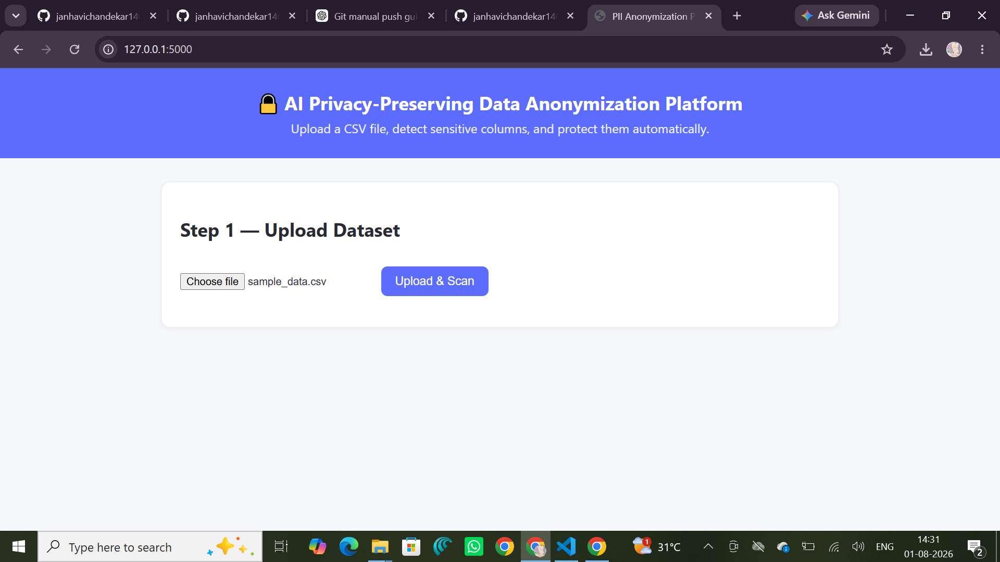
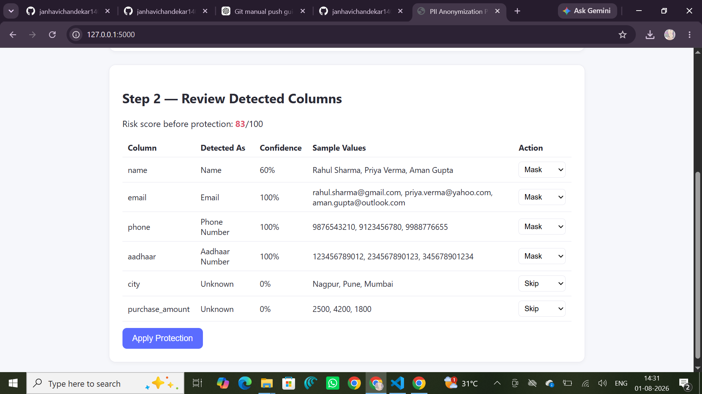

# 🔒 AI Privacy-Preserving Data Anonymization Platform

An AI-powered web application that detects Personally Identifiable Information (PII) in CSV datasets and protects sensitive information using multiple anonymization techniques.

Built with **Flask**, **Python**, and **Pandas**, this platform helps organizations reduce privacy risks while maintaining the usability of their data.

---

## ✨ Features

- 📂 Upload CSV datasets
- 🔍 Automatic PII detection
- 📊 Privacy Risk Score calculation
- 🔐 Multiple anonymization techniques:
  - Masking
  - Hashing
  - Encryption
  - Tokenization
- ⚙️ Choose different protection methods for each detected column
- 📥 Download anonymized CSV
- 📄 Generate GDPR / DPDP compliance report
- 🚀 Simple and responsive web interface

---
## 📸 Screenshots

### 🏠 Home Page

<p align="center">
  
  
</p>

### 🔍 PII Detection

<p align="center">
  
</p>

### 🔐 Anonymized Dataset

<p align="center">
  
</p>

### 📄 Compliance Report

<p align="center">
  
</p>

---

## 🛠️ Tech Stack

- Python
- Flask
- Pandas
- Cryptography
- FPDF
- HTML
- CSS
- JavaScript

---

## 📁 Project Structure

```
data-privacy-platform/
│
├── app.py
├── detector.py
├── anonymizer.py
├── report_generator.py
├── requirements.txt
├── sample_data.csv
│
├── templates/
│     └── index.html
│
├── static/
│
├── uploads/
├── outputs/
│
└── README.md
```

---

## 🚀 Installation

Clone the repository

```bash
git clone https://github.com/janhavichandekar1403-coder/data-privacy-platform.git
```

Move into the project

```bash
cd data-privacy-platform
```

Install dependencies

```bash
pip install -r requirements.txt
```

Run the application

```bash
python app.py
```

Open your browser

```
http://127.0.0.1:5000
```

---

## 🧪 Sample Dataset

A sample dataset (`sample_data.csv`) is included to demonstrate the anonymization process.

The application detects sensitive columns such as:

- Name
- Email
- Phone Number
- Aadhaar Number

and allows the user to choose the preferred anonymization technique.

---

## 🔐 Supported Privacy Techniques

| Technique | Description |
|------------|-------------|
| Masking | Hides part of the original value |
| Hashing | Converts data into irreversible SHA-256 hashes |
| Encryption | Encrypts data using Fernet encryption |
| Tokenization | Replaces sensitive values with generated tokens |

---

## 📄 Compliance Report

After anonymization, the platform automatically generates a PDF report containing:

- Dataset information
- Number of records
- Privacy Risk Score (Before & After)
- Protected columns
- Applied anonymization methods
- GDPR / DPDP compliance status

---

## 🎯 Future Improvements

- Support Excel and JSON datasets
- OCR support for scanned documents
- Machine Learning based PII detection
- Role-based authentication
- Database integration
- Cloud deployment
- REST API support

---

## 👩‍💻 Author

**Janhavi Chandekar**

GitHub: https://github.com/janhavichandekar1403-coder

---
